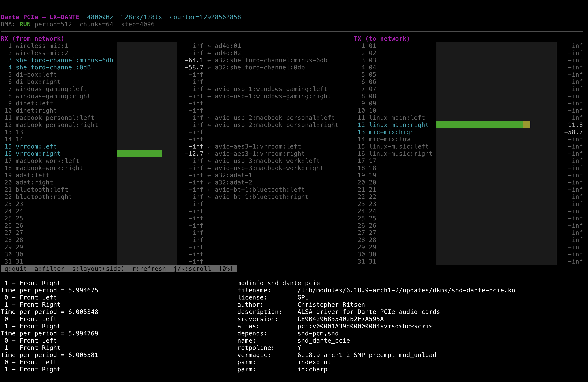

# snd-dante-pcie

Clean-room Linux ALSA kernel driver for Dante PCIe audio cards based on the Gennum GN4124 PCIe-to-local-bus bridge (PCI 0x1a39:0x0004).

Tested on: Digigram LX-DANTE (discontinued)



## Features

- 128 channels playback + 128 channels capture at 48kHz (also supports 44.1/88.2/96/176.4/192kHz with appropriate Dante Controller configuration)
- MMAP non-interleaved S32_LE format
- JACK-compatible with full duplex, period sizes from 16 to 8192+ frames
- VDMA sequencer microcode for chunk-based DMA with ring buffer wrap
- MSI interrupts with GN4124 4-vector routing quirk
- Debugfs: register access (`bar0`, `bar4`), DMA buffer access (`audio_rx`, `audio_tx`), per-channel peak meters (`meters`)
- Character device `/dev/dante-pcie` with ioctl for card info and mmap for direct DMA buffer access

## Building

```
make
sudo insmod snd-dante-pcie.ko
```

## Installing

```
sudo make install
sudo depmod
sudo modprobe snd-dante-pcie
```

To switch between this driver and the proprietary `dante_pcie` driver:

```
# Use clean-room driver
echo "blacklist dante_pcie" | sudo tee /etc/modprobe.d/dante-select.conf

# Use proprietary driver
echo "blacklist snd_dante_pcie" | sudo tee /etc/modprobe.d/dante-select.conf

# Remove preference (first found wins)
sudo rm /etc/modprobe.d/dante-select.conf
```

## Clean Room Sources

This driver was implemented exclusively from public documentation and hardware observation. No proprietary source code was consulted.

### Gennum/Semtech Documentation (not redistributable)

These documents are marked "Proprietary & Confidential" by Gennum/Semtech and are not included in this repository. They were formerly available from gennum.com and semtech.com and may be obtainable from Semtech support or electronics document archives.

| Document | Doc Number | MD5 | Description |
|----------|-----------|-----|-------------|
| GN412x PCI Express Family Reference Manual | 52624-0, June 2009 | `3e36d6b541f9ce823407acf8990e4837` | Register map, interrupt controller, GPIO, 169 pages |
| GN4124 Datasheet | 48407-1, May 2009 | `0299def68b9a70cdf6ffb12bda552c4e` | Pinout, electrical specs, 31 pages |
| Implementing Multi-channel DMA with the GN412x IP | 53715-0, December 2009 | `f0a9fe86bc8f5eb555dc9989d354c57e` | VDMA sequencer programming, 36 pages |

### Open Source References (included)

| Source | License | Description |
|--------|---------|-------------|
| [CERN gn4124-core](https://github.com/terpstra/gn4124-core) | GPL v2 | FlexDMA sequencer instruction encoding (`vdma_seqcode.h`) |
| `docs/observed_fpga_behavior.md` | Public domain | FPGA register behavior captured from hardware observation |
| `CLEAN_ROOM_SPEC.md` | Public domain | Hardware specification derived from the above sources |

## dante-live.py

The included `dante-live.py` is a TUI dashboard that displays real-time audio meters, channel names, and Dante routing via the `/dev/dante-pcie` character device. It uses mmap for zero-copy access to the DMA audio buffers.

Requires: `numpy`, `curses`

Optional: [`netaudio`](https://github.com/chris-ritsen/network-audio-controller) — if installed, dante-live.py displays Dante channel names and network routing info. Without it, channels are shown by number only.

## License

This is free and unencumbered software released into the public domain. See [LICENSE](LICENSE).

Note: The kernel module itself is licensed GPL (required for kernel MSI descriptor API access). The userspace tools and documentation are public domain.
